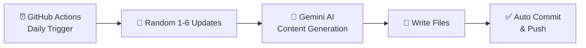

# 🤖 AI-Daily

> **Automatically updated every day** with AI articles, facts, interview questions, code examples, and more.
> Powered by Gemini AI + GitHub Actions.

---

## 📚 What's Inside

| Resource | Description |
|----------|-------------|
| [📰 Articles](articles/) | In-depth AI articles generated daily |
| [💡 AI Facts](facts.md) | Surprising and interesting AI facts |
| [🎯 Interview Questions](interview-questions.md) | Real ML/AI interview Q&A |
| [🐍 Code Examples](code-examples.md) | Practical Python AI examples |
| [📊 Diagrams](diagrams.md) | Mermaid diagrams of AI architectures |
| [🧠 Quizzes](quizzes.md) | Test your AI knowledge |
| [📋 Summaries](summaries.md) | Concise concept summaries |

---

## 📰 Recent Articles

- [Ai Agents And Agentic Workflows](articles/ai-agents-and-agentic-workflows.md)
- [Ai In Healthcare](articles/ai-in-healthcare.md)
- [Ai Safety And Alignment](articles/ai-safety-and-alignment.md)
- [Constitutional Ai And Rlhf](articles/constitutional-ai-and-rlhf.md)
- [Vector Databases And Embeddings](articles/vector-databases-and-embeddings.md)

---

## ⚙️ How It Works

1. **GitHub Actions** triggers the workflow every day at midnight UTC
2. A **random delay** (0–60 min) is applied to vary the actual run time
3. The script picks **1–6 random update types** using weighted randomness
4. **Gemini AI** generates high-quality, unique content
5. Changes are committed with **descriptive messages** and pushed automatically

---

## 🚀 Setup (One-time)

See [SETUP.md](SETUP.md) for full configuration instructions.

---

## 📈 Statistics

- **Total Articles:** 5
- **Last Updated:** 2026-07-16
- **Auto-updates:** Daily ♻️

---

*This repository is 100% automated. All content is AI-generated for educational purposes.*
