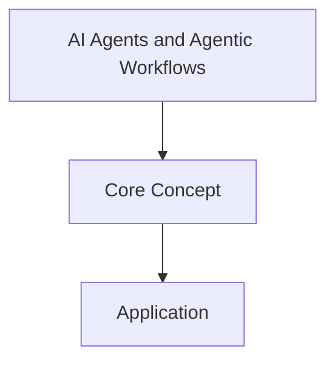
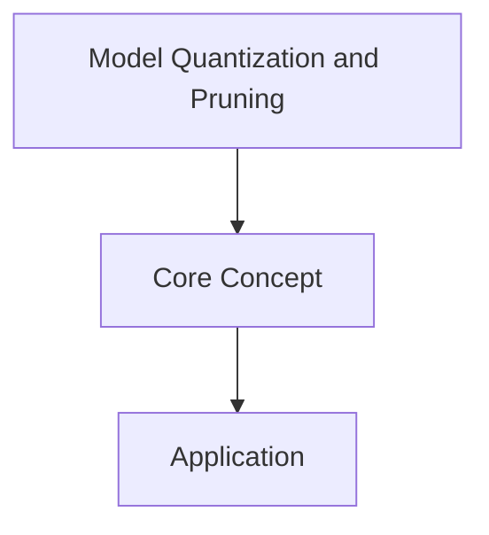

# 📊 AI Architecture Diagrams

Mermaid diagrams explaining AI concepts visually — automatically updated daily.

---

## 2026-07-06 — Diagram: AI Agents and Agentic Workflows



## 2026-07-09 — Diagram: Mixture of Experts (MoE)

```mermaid
graph TD
    A[Mixture of Experts (MoE)] --> B[Core Concept]
    B --> C[Application]
```

## 2026-07-12 — Diagram: Model Quantization and Pruning



## 2026-07-18 — Diagram: Low-Rank Adaptation (LoRA)

```mermaid
graph TD
    A[Low-Rank Adaptation (LoRA)] --> B[Core Concept]
    B --> C[Application]
```

