# 📊 AI Architecture Diagrams

Mermaid diagrams explaining AI concepts visually — automatically updated daily.

---

## 2026-07-06 — Diagram: AI Agents and Agentic Workflows

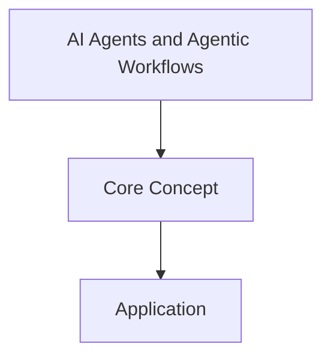
```mermaid
graph TD
    A[AI Agents and Agentic Workflows] --> B[Core Concept]
    B --> C[Application]
```

## 2026-07-09 — Diagram: Mixture of Experts (MoE)

```mermaid
graph TD
    A[Mixture of Experts (MoE)] --> B[Core Concept]
    B --> C[Application]
```

## 2026-07-12 — Diagram: Model Quantization and Pruning

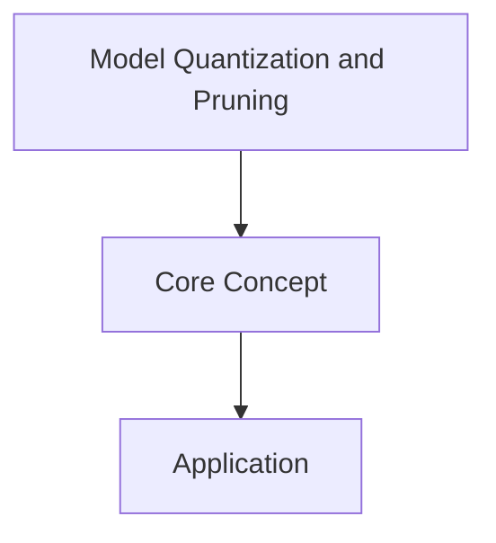
```mermaid
graph TD
    A[Model Quantization and Pruning] --> B[Core Concept]
    B --> C[Application]
```

## 2026-07-18 — Diagram: Low-Rank Adaptation (LoRA)

```mermaid
graph TD
    A[Low-Rank Adaptation (LoRA)] --> B[Core Concept]
    B --> C[Application]
```

## 2026-07-19 — Diagram: Tool-using AI (Function Calling)

```mermaid
graph TD
    A[Tool-using AI (Function Calling)] --> B[Core Concept]
    B --> C[Application]
```

## 2026-07-22 — Diagram: Graph Neural Networks

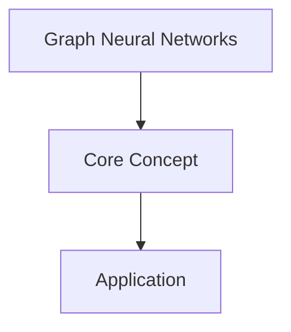
```mermaid
graph TD
    A[Graph Neural Networks] --> B[Core Concept]
    B --> C[Application]
```

## 2026-07-24 — Diagram: Fine-tuning vs In-context Learning

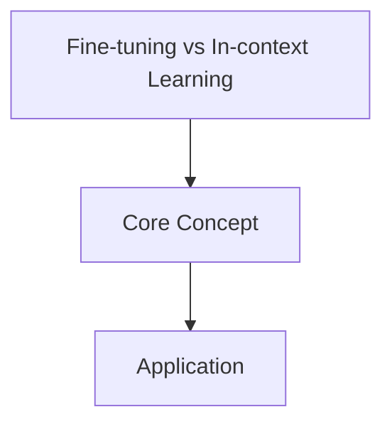
```mermaid
graph TD
    A[Fine-tuning vs In-context Learning] --> B[Core Concept]
    B --> C[Application]
```

## 2026-07-25 — Diagram: AI Agents and Agentic Workflows

```mermaid
graph TD
    A[AI Agents and Agentic Workflows] --> B[Core Concept]
    B --> C[Application]
```

## 2026-07-28 — Diagram: Low-Rank Adaptation (LoRA)

```mermaid
graph TD
    A[Low-Rank Adaptation (LoRA)] --> B[Core Concept]
    B --> C[Application]
```

## 2026-07-30 — Diagram: Model Context Windows

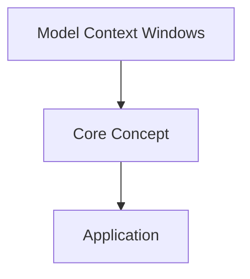
```mermaid
graph TD
    A[Model Context Windows] --> B[Core Concept]
    B --> C[Application]
```

## 2026-08-02 — Diagram: Vector Databases and Embeddings

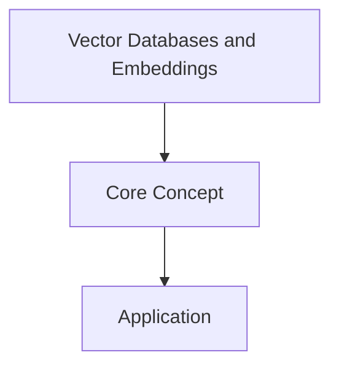
```mermaid
graph TD
    A[Vector Databases and Embeddings] --> B[Core Concept]
    B --> C[Application]
```

## 2026-08-07 — Diagram: Model Quantization and Pruning

```mermaid
graph TD
    A[Model Quantization and Pruning] --> B[Core Concept]
    B --> C[Application]
```

## 2026-08-14 — Diagram: AI in Healthcare

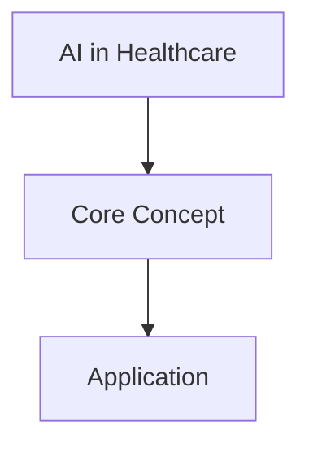
```mermaid
graph TD
    A[AI in Healthcare] --> B[Core Concept]
    B --> C[Application]
```

## 2026-08-16 — Diagram: Retrieval-Augmented Generation (RAG)

```mermaid
graph TD
    A[Retrieval-Augmented Generation (RAG)] --> B[Core Concept]
    B --> C[Application]
```

## 2026-08-18 — Diagram: Model Context Windows

```mermaid
graph TD
    A[Model Context Windows] --> B[Core Concept]
    B --> C[Application]
```

## 2026-08-23 — Diagram: Tool-using AI (Function Calling)

```mermaid
graph TD
    A[Tool-using AI (Function Calling)] --> B[Core Concept]
    B --> C[Application]
```

## 2026-08-24 — Diagram: Chain-of-Thought Reasoning

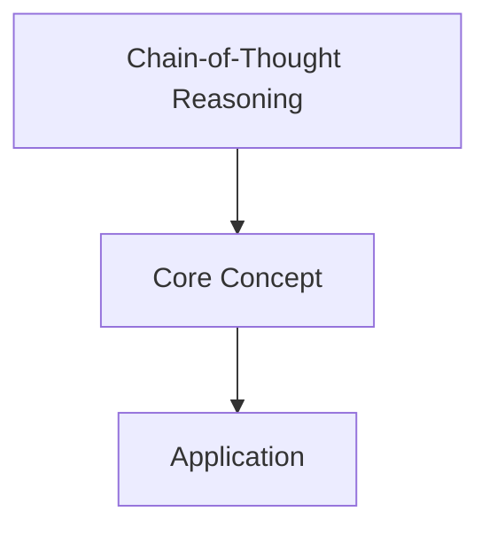
```mermaid
graph TD
    A[Chain-of-Thought Reasoning] --> B[Core Concept]
    B --> C[Application]
```

## 2026-09-08 — Diagram: Federated Learning

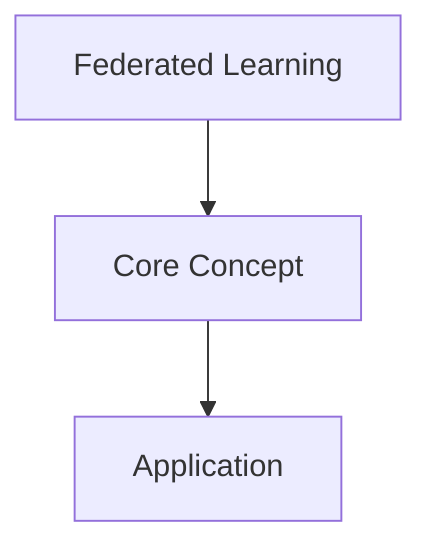
```mermaid
graph TD
    A[Federated Learning] --> B[Core Concept]
    B --> C[Application]
```

## 2026-09-10 — Diagram: Attention Mechanisms

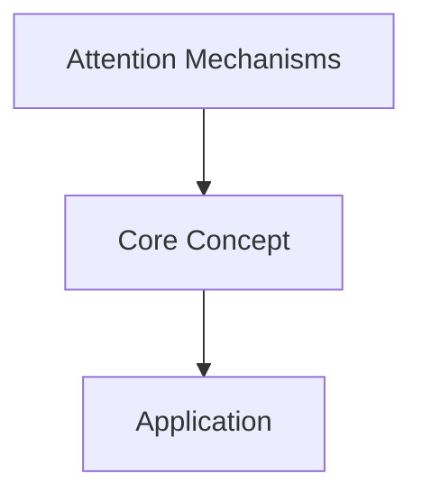
```mermaid
graph TD
    A[Attention Mechanisms] --> B[Core Concept]
    B --> C[Application]
```

## 2026-09-11 — Diagram: AI Ethics and Bias

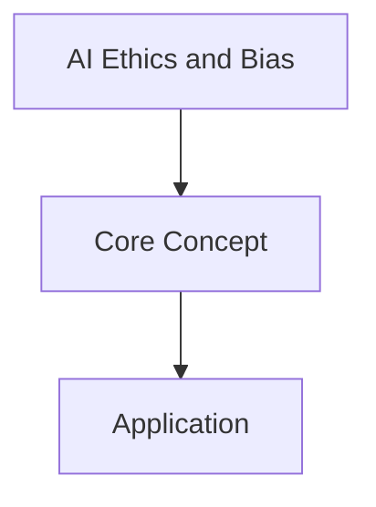
```mermaid
graph TD
    A[AI Ethics and Bias] --> B[Core Concept]
    B --> C[Application]
```

